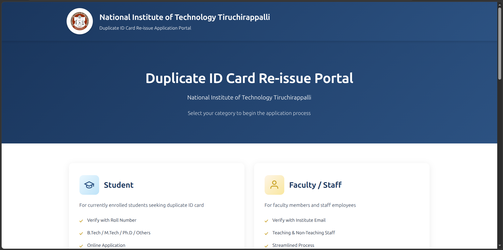
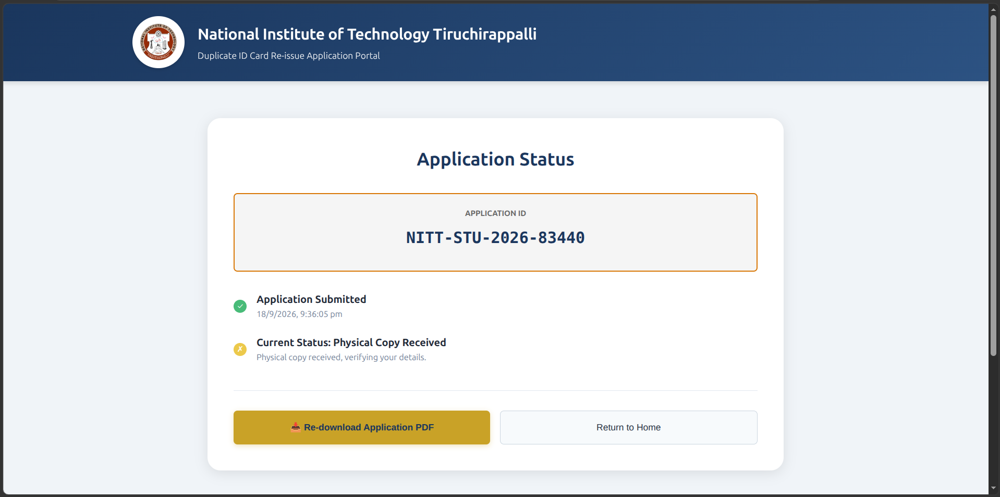
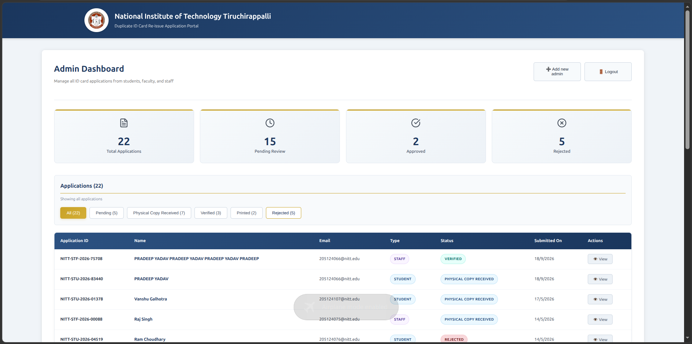

# NIT Library ID Card Portal 📚


A complete MERN stack application designed for the National Institute of Technology, Tiruchirappalli (NITT). This portal allows students, faculty, and staff to easily apply for duplicate or replacement ID cards, track their application status, and provides an admin dashboard for library staff to manage the entire workflow.

---

## 📸 Screenshots

*(Replace these placeholder images by dropping your screenshots into the `docs/screenshots/` folder)*

### Public Portal (Applicant View)
<p align="center">
  
  <br/>
  <em>Home Page & Application Flow</em>
</p>

### Public Tracking
<p align="center">
  
  <br/>
  <em>Live Application Status Tracking</em>
</p>

### Admin Dashboard (Library Staff)
<p align="center">
  
  <br/>
  <em>Secure Admin Dashboard for processing applications</em>
</p>

---

## 🚀 Features

- **Multi-Role Support:** Specific workflows for Students, Faculty, and Staff.
- **Secure Authentication:** Cookie-based JWT authentication, rate limiting, and 2FA via OTP for admins.
- **Live Tracking:** Applicants can track their ID card status securely using their Application ID.
- **Automated Emails:** Email notifications sent at every stage of the application workflow via Nodemailer.
- **AWS S3 Integration:** Secure file uploads (Photos, FIRs, Payment Receipts) directly to Amazon S3.
- **Admin Workflow:** Library staff can transition applications through logical states (`Pending` → `Verified` → `Printed`).

---

## 🛠️ Technology Stack

- **Frontend:** React (Vite), React Router, Vanilla CSS, Axios
- **Backend:** Node.js, Express.js, Mongoose
- **Database:** MongoDB Atlas
- **Storage:** AWS S3 (via `@aws-sdk/client-s3`)
- **Security:** Helmet, Express-Rate-Limit, Mongo Sanitize, HttpOnly Cookies

---

## 💻 Local Development

### Prerequisites
- Node.js (v20+)
- MongoDB connection string
- AWS S3 bucket and IAM credentials (optional for local, falls back to local storage)

### 1. Clone & Install
```bash
git clone https://github.com/pradeepyadav5137/Library.git
cd Library

# Install backend dependencies
cd backend
npm install

# Install frontend dependencies
cd ../frontend
npm install
```

### 2. Environment Variables
Create a `.env` file in the `backend/` directory using `.env.example`:
```bash
cp .env.example backend/.env
```
Fill out your `.env` with your MongoDB URI, AWS details, and email configurations.

### 3. Run the Servers
**Backend:**
```bash
cd backend
npm run dev
# Runs on http://localhost:5000
```

**Frontend:**
```bash
cd frontend
npm run dev
# Runs on http://localhost:3000
```

---

## 🌍 Deployment

The project includes a streamlined deployment script for EC2 instances (`deployment/deploy.sh`). 

To deploy:
1. Ensure your EC2 is set up with Nginx, PM2, and Node.js.
2. Update the `EC2_IP` in `deploy.sh`.
3. Set your production secrets in `backend/.env`.
4. Run:
```bash
bash deployment/deploy.sh
```

---

## 🔒 Security Best Practices Implemented
- S3 signed URLs with short expirations to protect PII (Personally Identifiable Information).
- JWTs stored in `HttpOnly` cookies, preventing XSS token theft.
- Granular rate limiting on sensitive routes (OTP generation, Admin login).
- Strict Multer validation to prevent arbitrary file execution.
